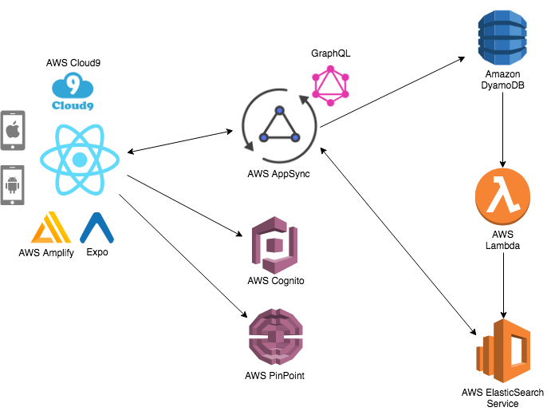
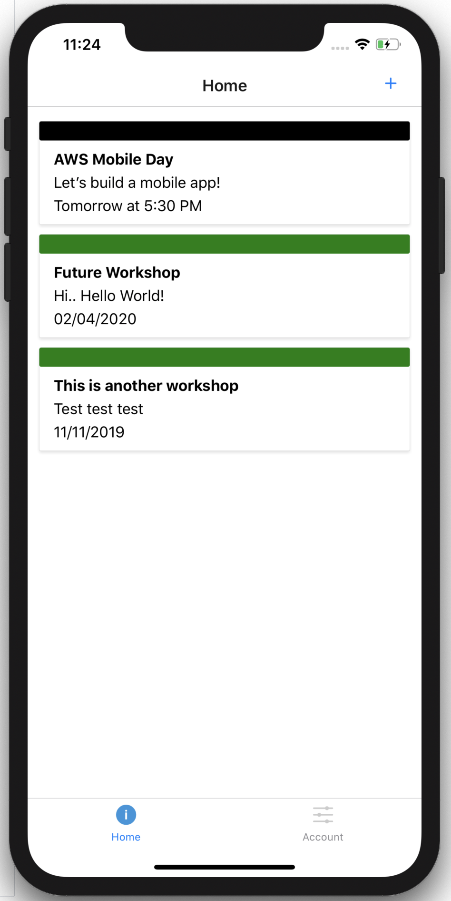
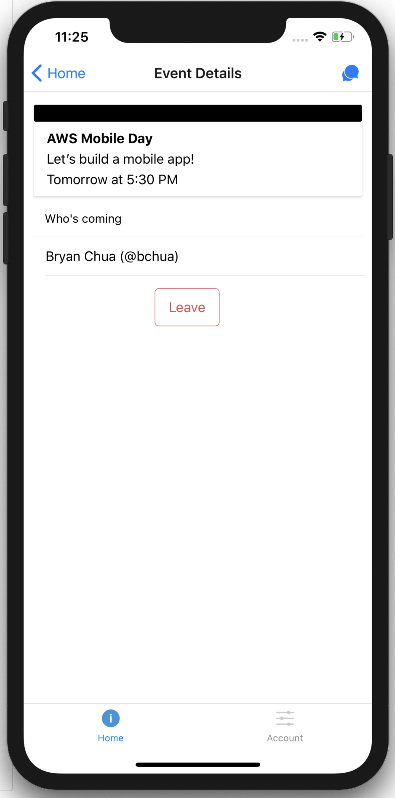
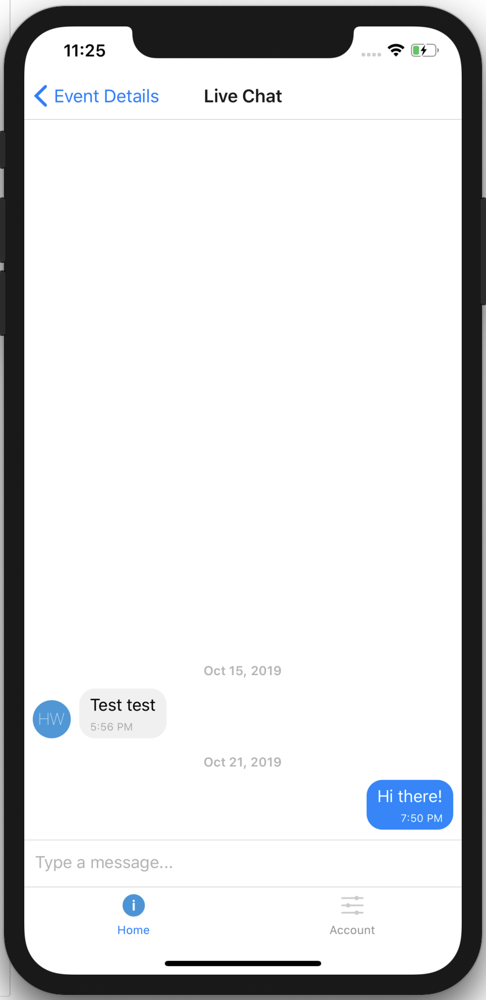

# React Native The AWSome Way!

This is a self-paced workshop designed for developers who want to build a React Native mobile application using mobile services from Amazon Web Services (AWS).

## Reference Architecture



Our application allow users to create meetups and also to join existing meetups. Each meetup has also a chat feature to let users discuss about the event.

### Screenshots

<p float="left">



</p>

The data model will consist of:

- **Users**: a list of users who are using the app
- **Events**: a list of events created by the users in the app
- **Chats**: a list of chat messages created in the event by users
- **EventUserJoined**: a joint table between users and events to indicate who is joining which events

Our mobile application will be written in [React Native](https://facebook.github.io/react-native/). We will also be using [AWS Amplify](https://aws-amplify.github.io/amplify-js/index.html). AWS Amplify provides a declarative and make it really easy to add features like authentication and analytic to our mobile application. Our backend will be powered by AWS AppSnyc, a fully managed GraphQL service. AWS AppSync defines a GraphQL Schema with data types and GraphQL operations (query, mutation and subscription). It also associate a set of resolvers to Amazon DynamoDB, where we have 4 tables for our data models.

## [Lab 1](setup/)

Setup AWS Cloud9, expo client, React native development and AWS environment.

## [Lab 2](amplify/)

Run AWS Amplify CLI & setup Auth in AWS Cloud9.

## [Lab 3](appsync/)

Setup AppSync & update GraphQL schema.

## [Lab 4](app/)

Run your React Native App on your Mobile Device!

## [Lab 5](pinpoint/)

Add Analytics and reach out to your users at real-time!

## # Pro Tips

Before moving to the next module, a brief word on working with the Amplify command line tools. Some operations present a multiple choice option such as the one shown below. In these cases, you can use the space bar to select one or more of the options before pressing the enter button to move to the next question. Selected choices will have a filled circle instead of an outline.

```bash
? Pick one or more of the following options.
❯◯ not selected 1
 ◉ selected
 ◯ not selected 2
```

## Clean up

If you ever need to clean up your AWS account, you just need to run the following command in your AWS Cloud9 environment:

```
amplify delete
```

And once done, you can now delete your AWS Cloud9 instance.


## License Summary

This sample code is made available under the MIT-0 license. See the LICENSE file.
