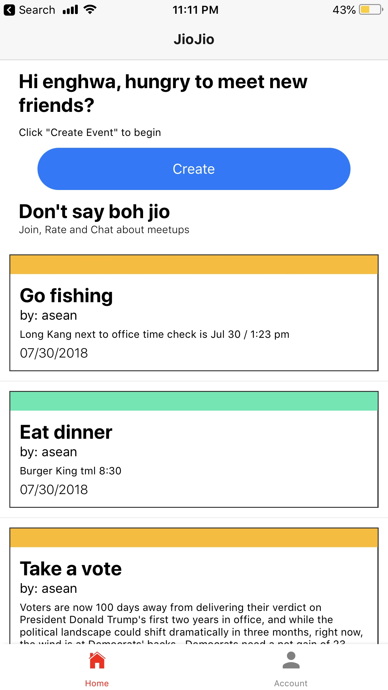
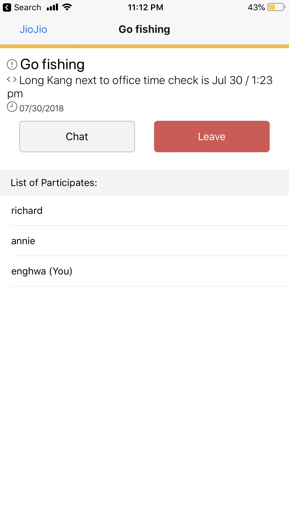
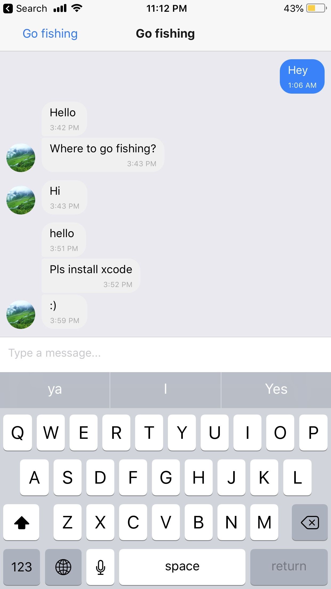

# React Native The AWSome Way!

This is a self-paced workshop designed for developers who want to build a React Native mobile application using mobile services from Amazon Web Services (AWS).

## Reference Architecture


Our application allow users to create meetups and also to join existing meetups. Each meetup has also a chat feature to let users discuss about the event.

### Screenshots

<p float="left">



</p>

The data model will consist of:
* **Users**: a list of users who are using the app
* **Events**: a list of events created by the users in the app
* **Chats**: a list of chat messages created in the event by users
* **EventUserJoined**: a joint table between users and events to indicate who is joining which events

Our mobile application will be written in [React Native](https://facebook.github.io/react-native/). We will also be using [AWS Amplify](https://aws-amplify.github.io/amplify-js/index.html). AWS Amplify provides a declarative and make it really easy to add features like authentication and analytic to our mobile application. Our backend will be powered by AWS AppSnyc, a fully managed GraphQL service. AWS AppSync defines a GraphQL Schema with data types and GraphQL operations (query, mutation and subscription). It also associate a set of resolvers to Amazon DynamoDB, where we have 4 tables for our data models.


## [Lab 1](setup/)
Setup AWS Cloud9, expo client and AWS environment.

## [Lab 2](amplify/)
Setup React Native development environment and AWS Amplify CLI in AWS Cloud9.

## [Lab 3](appsync/)
Setup AppSync & configure Cognito trigger in AWS console with AWS Lambda

## [Lab 4](app/)
Run your React Native App on your Mobile Device!

<!-- ## [Lab 5](cicd/) 
CI/CD for your React Native App
 -->

## Clean up

If you ever need to clean up your AWS account, you just need to run the following command in your AWS Cloud9 environment:

```
amplify delete
```

And delete your AWS Cloud9 instance. 


## License Summary

This sample code is made available under the MIT-0 license. See the LICENSE file.
