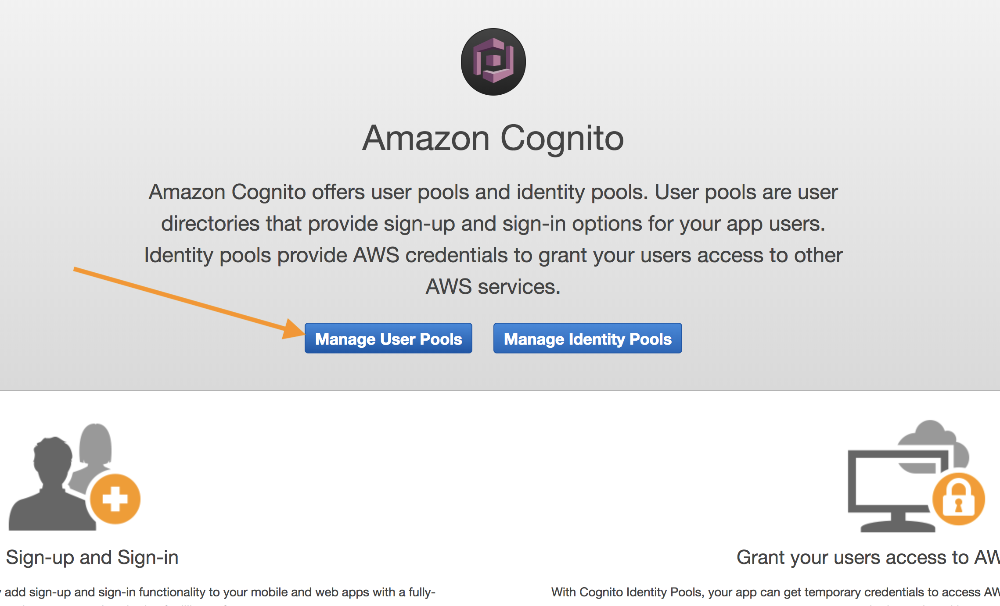
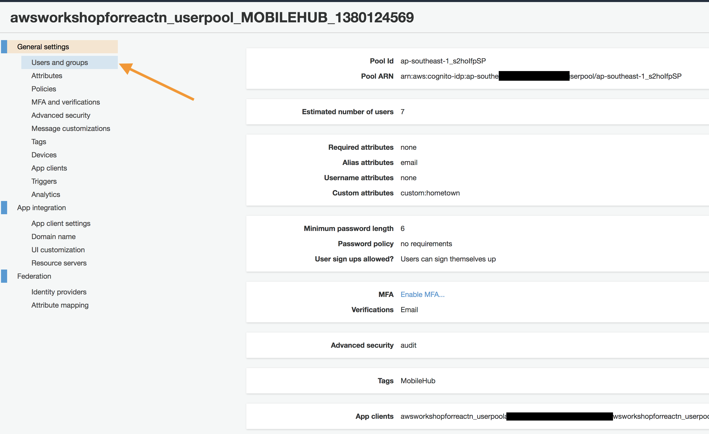
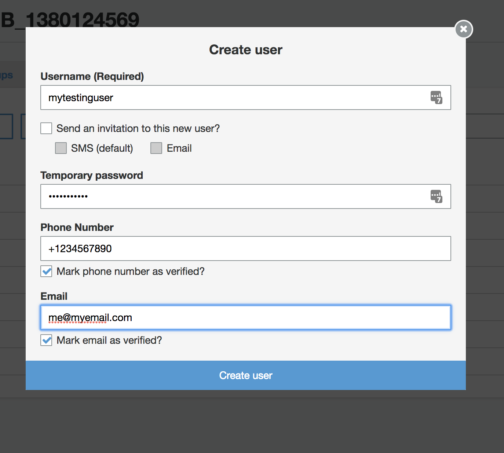

# AWS Amplify

AWS Amplify provides a declarative and easy-to-use interface across different categories of cloud operations. AWS Amplify goes well with any JavaScript based frontend workflow, and React Native for mobile developers.

## Table of Contents:
* [Initialise a development project](#initialise-a-development-project)
* [Add Cognito user pool](#add-cognito-user-pool)
* [Create a Cognito user](#create-a-cognito-user)

## Initialise a development project

We have prepared a sample app for you in this exercise. Simple `git clone` the repo `https://github.com/aws-samples/aws-amplify-react-native-events-app-workshop` into another folder and copy the content to your `rn` folder on the following commands:

```
cd /code
git clone https://github.com/aws-samples/aws-amplify-react-native-events-app-workshop app
mv app/sample/* .
rm -Rf app/
```

Run this command inside the react-native docker environment. 

**IMPORTANT**: Ensure you are in the ```/code``` directory.
```
amplify init
```

Follow the commands in the following, take note that the `project's sourced directory` is ``.`` 
```
Note: It is recommended to run this command from the root of your app directory
? Choose your default editor: None
? Choose the type of app that you're building javascript
Please tell us about your project
? What javascript framework are you using react-native
? Source Directory Path:  /
? Distribution Directory Path: /
? Build Command:  npm run-script build
? Start Command: npm run-script start
Using default provider awscloudformation

For more information on AWS Profiles, see:
https://docs.aws.amazon.com/cli/latest/userguide/cli-multiple-profiles.html

Using default provider  awscloudformation
AWS access credentials can not be found.
? Setup new user Yes
Follow these steps to set up access to your AWS account:

Sign in to your AWS administrator account:
https://console.aws.amazon.com/
Press Enter to continue

Specify the AWS Region
? region:  ap-southeast-1
Specify the username of the new IAM user:
? user name:  amplify-user
Complete the user creation using the AWS console
https://console.aws.amazon.com/iam/home?region=undefined#/users$new?step=final&accessKey&userNames=amplify-user&permissionType=policies&policies=arn:aws:iam::aws:policy%2FAdministratorAccess
Press Enter to continue

Enter the access key of the newly created user:
? accessKeyId:  XXXXXX**********
? secretAccessKey:  XXXXXXXXXXX********************
This would update/create the AWS Profile in your local machine
? Profile Name:  default

Successfully set up the new user.

For more information on AWS Profiles, see:
https://docs.aws.amazon.com/cli/latest/userguide/cli-multiple-profiles.html

? Do you want to use an AWS profile? Yes
? Please choose the profile you want to use. default
```

Then you should see a bunch of `CREATE_IN_PROGRESS` commands running at the background for you. These are cloudformation templates that are automatically generated via the `init` command.

You should see this output:
```
✔ Successfully created initial AWS cloud resources for deployments.

Your project has been successfully initialized and connected to the cloud!

Some next steps:
"amplify status" will show you what you've added already and if it's locally configured or deployed
"amplify <category> add" will allow you to add features like user login or a backend API
"amplify push" will build all your local backend resources and provision it in the cloud
"amplify publish" will build all your local backend and frontend resources (if you have hosting category added) and provision it in the cloud

Pro tip:
Try "amplify add api" to create a backend API and then "amplify publish" to deploy everything
```

## Add Cognito user pool

We need a way to authenticate the users of our app. We will use Amazon Cognito as our user directory. Setting it up is as simple as running the command below inside the react-native docker environment.
```
amplify auth add
```

You should see:

```
Using service: Cognito, provided by: awscloudformation
 The current configured provider is Amazon Cognito. 
 Do you want to use the default authentication and security configuration? 
❯ Default configuration 
  Default configuration with Social Provider (Federation) 
  Manual configuration 
  I want to learn more. 
```

You can choose to setup your own configuration. At this point, let's choose the default configuration. Press `Enter`

```
 Warning: you will not be able to edit these selections. 
 How do you want users to be able to sign in when using your Cognito User Pool? (Use arrow keys)
❯ Username 
  Email 
  Phone Number 
  Email and Phone Number 
  I want to learn more. 
```

Select `Username` and press `Enter` to continue. 

```
 Warning: you will not be able to edit these selections. 
 What attributes are required for signing up? (Press <space> to select, <a> to toggle all, <i> to invert selection)
❯◯ Address (This attribute is not supported by Facebook, Google, Login With Amazon.)
 ◯ Birthdate (This attribute is not supported by Login With Amazon.)
 ◉ Email
 ◯ Family Name (This attribute is not supported by Login With Amazon.)
 ◯ Middle Name (This attribute is not supported by Google, Login With Amazon.)
 ◯ Gender (This attribute is not supported by Login With Amazon.)
 ◯ Locale (This attribute is not supported by Facebook, Google.)
(Move up and down to reveal more choices)
```

Select `Email` as the required attributes. Press `Enter` and now, you should see:

```
Successfully added auth resource
```

Some next steps:
"amplify push" will build all your local backend resources and provision it in the cloud
"amplify publish" will build all your local backend and frontend resources (if you have hosting category added) and provision it in the cloud
```

At this point, you can choose to re-configure your `Auth` again by entering the following command:

```
amplify auth update
```

We will now push the settings to your AWS account. This will create a Cognito User Pool automatically for you via CloudFormation.

Run this command inside the react-native docker environment:
```
amplify push
```

At this point, you can see a table that shows the overall changes that are going to be made:
```
| Category | Resource name   | Operation | Provider plugin   |
| -------- | --------------- | --------- | ----------------- |
| Auth     | cognito80421876 | Create    | awscloudformation |
? Are you sure you want to continue? (Y/n) 
```

Press `Y` and `Enter` to confirm. This will take a few minutes to run. Once done, you should see the following:

```
✔ All resources are updated in the cloud
```

## Create a Cognito user
1. Let's set up a user for testing. Navigate to your [Cognito Console](https://console.aws.amazon.com/cognito/home)

2. Select **Manage User Pools**


3. Select the **Cognito User Pool** that was generated by Mobile Hub and click on Users and groups.


4. Click **Create User** to begin

5. Fill up the form to create your first user in Cognito for testing purpose in the next lab. At this time, you do not need a real phone number and email. Refer to the screenshot below for more information and click **Create User** to proceed.


6. Check that your newly created user is in the users table with the status column set to **FORCE_CHANGE_PASSWORD** and enabled column set to **ENABLED**

You have successfully configured the AWS Mobile for your mobile app. Next, you can proceed to [Lab 3](../appsync) to work on setting the AWS AppSync.