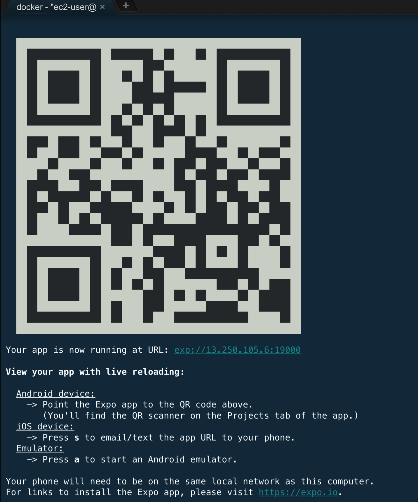

# React Native App with AWS Mobile Hub & AppSync

## Prerequisite

[Setup Cloud9](../setup/)

[Setup Amplify](../amplify/)

[Setup AppSync](../appsync/)

## Setup & Run The React Native App

Make sure you are **inside React Native Docker** environment, you can now run the following command:

```
cd /code && yarn
yarn start
```

**Note**: if your `yarn` is **outdated**, please enter the following command to upgrade `yarn`:

```
curl -o- -L https://yarnpkg.com/install.sh | bash
```

**Note** if you see the following **no space left** error, please restart your Cloud9 instance.

```
Error: ENOSPC: no space left on device, write
error Could not write file "/code/yarn-error.log": "ENOSPC: no space left on device, write"
error An unexpected error occurred: "Command failed.
Exit code: 1
```

## Run your App in Expo

Once you have successfully ran `yarn start` without any errors, you should see the following screen on the Docker terminal.



Follow following instructions to get this application to work on your phone.

**iPhone users** On your safari, follow the steps. (The QR code does not work)

```
1. Open a new tab on your safari
2. In the URL/search bar, enter the url in the format of exp://<ip adderss> from your Docker terminal.
3. For our case, it was exp://13.250.105.6:19000
```

**Android users** Open your camera app, follow the steps

```
1. Point your camera at the QR code that appears on your Docker terminal
```

## Bonus Exercise

Notice that some part of the app might not be working. You are not complete the following in order to make this app work:

1. Complete the graphql query events at `src/screens/EventScreen.js`

2. Refer to the original architecture diagram in the main page and figure out how to add Elasticsearch capabilities via AppSync Schema [Annotations](https://aws-amplify.github.io/docs/js/api#using-graphql-transformers).
